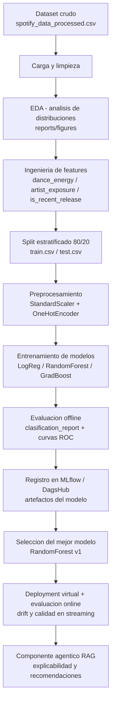

# Proyecto 2 - Prediccion de Popularidad de Tracks de Spotify

**Especializacion en Machine Learning Engineering - Curso II**
**Entrega final: 30 de Agosto de 2026**

Repositorio del trabajo final: <https://dagshub.com/0DaikiHajime0/Proyecto2>

---

## 1. Problema de Machine Learning

### Tipo de problema

Aprendizaje supervisado, **clasificacion multiclase (3 clases)**: dado un track de
Spotify, predecir su categoria de popularidad (`popularity_category`):

- `Low`  (baja)
- `Medium` (media)
- `High` (alta)

### Contexto de negocio

Sellos discograficos, managers y artistas necesitan anticipar el nivel de popularidad
de un track antes (o justo despues) de su lanzamiento para decidir produccion,
promocion y distribucion. La popularidad es una variable **consecuencia** del exito
(reproducciones, listas, interacciones), por lo que el modelo usa solo caracteristicas
disponibles sin fuga de informacion (`popularity`, `stream_count` y derivadas quedan
descartadas como features).

### Objetivo e hipotesis

Diseñar y evaluar un pipeline de ML end-to-end que prediga la categoria de
popularidad del track a partir de caracteristicas acusticas (danceability, energy,
loudness, tempo, instrumentalness), del genero y de metadata de lanzamiento.

**Hipotesis:** las caracteristicas acusticas y de contexto de lanzamiento contienen
informacion predictiva suficiente para clasificar la popularidad mejor que un
predictor basado en la clase mayoritaria.

### Metricas de exito

- **Metrica primaria:** F1-macro (por el desbalance entre clases).
- Metricas secundarias: accuracy, precision-macro, recall-macro, F1-weighted, ROC-AUC OVR.
- Linea base: predictores constantes (clase mayoritaria `Medium`, 75.4% de los datos).

### Componente agentico (GenAI)

Ademas del modelo clasico, el proyecto incluye un agente con **RAG
(Retrieval-Augmented Generation)** que:

- Explica en lenguaje natural por que un track se clasifico en determinada categoria.
- Recomienda acciones de produccion/promocion para mejorar la popularidad esperada.
- Responde preguntas sobre patrones historicos del dataset.

---

## 2. Diagrama de flujo del proyecto

Pasos en orden (scripts reproducibles):

1. **Preprocesamiento** - `scripts/run_preprocessing.py`: carga, limpieza,
   ingenieria de features y split estratificado.
2. **Entrenamiento** - `scripts/run_training.py`: entrena 3 modelos, loguea
   metricas y artefactos en MLflow/DagsHub, y registra el mejor en Model Registry.
3. **Evaluacion** - comparativa de modelos, matriz de confusion, curvas ROC
   (`reports/figures/*.png`).
4. **Registro** - `spotify_popularity_model` (Random Forest) version 1 en el registro
   de DagsHub.
5. **Online (simulado)** - deployment virtual con streaming, monitoreo de drift y
   metricas de calidad en linea.

---

## 3. Dataset y diccionario de datos

### Descripcion del dataset

| Atributo | Detalle |
|---|---|
| Nombre | Spotify Artist Streaming Analytics (tracks 2015-2025) |
| Naturaleza | Dataset sintetico generado para practica de MLE |
| Filas | 85,000 tracks |
| Columnas | 33 |
| Tipo | Supervisado (target `popularity_category`) |
| Origen | Kaggle - Spotify Artist Streaming Analytics |
| Formato | `CSV` en `data/raw/spotify_data_processed.csv` |

### Distribucion de la variable objetivo

| Categoria | Proporcion |
|---|---|
| Medium | 75.4% |
| Low | 12.8% |
| High | 11.8% |

Dataset **desbalanceado** hacia `Medium` (75.4%). Por eso la metrica primaria es F1-macro.

### Diccionario de datos

| # | Columna | Tipo | Descripcion | Uso |
|---|---|---|---|---|
| 1 | `track_id` | object | Identificador unico del track | ID (descartada) |
| 2 | `track_name` | object | Nombre del track | ID (descartada) |
| 3 | `artist_name` | object | Nombre del artista | ID (descartada) |
| 4 | `album_name` | object | Nombre del album | ID (descartada) |
| 5 | `release_date` | object | Fecha de lanzamiento (ISO) | ID (descartada) |
| 6 | `genre` | object | Genero musical principal (ej. Pop, Rock) | Feature categorica |
| 7 | `duration_ms` | int64 | Duracion en milisegundos | Feature numerica |
| 8 | `popularity` | int64 | Indice de popularidad Spotify (0-100) | FUGA - descartada |
| 9 | `danceability` | float64 | Que tan bailable (0-1) | Feature numerica |
| 10 | `energy` | float64 | Intensidad/actividad percibida (0-1) | Feature numerica |
| 11 | `key` | int64 | Tonalidad en entero (0=C a 11=B) | - (se usa `key_name`) |
| 12 | `loudness` | float64 | Sonoridad promedio (dB) | Feature numerica |
| 13 | `mode` | int64 | Modalidad (0=menor, 1=mayor) | - (se usa `mode_name`) |
| 14 | `instrumentalness` | float64 | Probabilidad de ser instrumental (0-1) | Feature numerica |
| 15 | `tempo` | float64 | Tempo en BPM | Feature numerica |
| 16 | `stream_count` | int64 | Numero de reproducciones | FUGA - descartada |
| 17 | `country` | object | Pais de mayor difusion | Descartada (remainder drop) |
| 18 | `explicit` | int64 | Contenido explicito (0/1) | Feature numerica |
| 19 | `label` | object | Discografica/distribuidora | ID (descartada) |
| 20 | `release_year` | int64 | Ano de lanzamiento | Feature numerica |
| 21 | `release_month` | int64 | Mes de lanzamiento (1-12) | Feature numerica |
| 22 | `release_day_of_week` | object | Dia de la semana (Mon-Sun) | Feature categorica |
| 23 | `duration_minutes` | float64 | Duracion en minutos (derivada) | - (no usada) |
| 24 | `popularity_category` | object | **TARGET**: Low / Medium / High | Variable objetivo |
| 25 | `loudness_category` | object | Nivel de loudness (derivada) | Feature categorica |
| 26 | `key_name` | object | Tonalidad en texto (derivada de `key`) | Feature categorica |
| 27 | `mode_name` | object | Modalidad en texto (derivada de `mode`) | Feature categorica |
| 28 | `is_explicit_bool` | bool | Flag de contenido explicito | - (se usa `explicit`) |
| 29 | `release_quarter` | int64 | Trimestre de lanzamiento (1-4) | Feature numerica |
| 30 | `is_weekend_release` | bool | Lanzamiento en fin de semana | Feature categorica |
| 31 | `log_stream_count` | float64 | ln(stream_count) | FUGA - descartada |
| 32 | `upbeat_score` | float64 | Derivada de danceability y energy | FUGA - descartada |
| 33 | `artist_track_count` | int64 | Tracks del artista en el dataset | Feature numerica |

### Ingenieria de features (anadidas en el pipeline)

| Feature | Formula | Justificacion |
|---|---|---|
| `dance_energy` | `danceability * energy` | Interaccion acustica |
| `is_recent_release` | `1 if release_year >= 2020 else 0` | Efecto temporal |
| `artist_exposure` | `1 / artist_track_count` | Exposicion del artista |

### Division de datos

- **Split:** 80/20 estratificado por `popularity_category` (random_state=42).
- `data/processed/train.csv`: 68,000 filas.
- `data/processed/test.csv`: 17,000 filas.

---

## 4. Model Card

Metodologia de referencia: <https://www.kaggle.com/code/var0101/model-cards>

### Informacion general

| Campo | Valor |
|---|---|
| Nombre del modelo | `spotify_popularity_model` |
| Version | 1 (v1) |
| Autores | Estudiante - Especializacion MLE Curso II |
| Fecha | 30 de Agosto de 2026 |
| Tipo de modelo | `sklearn.pipeline.Pipeline` (preprocesador + RandomForestClassifier) |
| Input | 20 features (14 numericas escaladas + categoricas one-hot) |
| Output | Probabilidad de pertenencia a `Low` / `Medium` / `High` |
| Licencia | Uso educativo |
| Registro | Model Registry en <https://dagshub.com/0DaikiHajime0/Proyecto2.mlflow/#/models> |

### Descripcion del modelo

Pipeline de sklearn con `StandardScaler` sobre features numericas, `OneHotEncoder`
sobre features categoricas y un `RandomForestClassifier` como clasificador. Se
entreno comparativamente contra `LogisticRegression` y `GradientBoostingClassifier`.

### Usos previstos (Intended use)

- Clasificacion de popularidad de tracks **antes del lanzamiento** (usa solo
  metadatos y descriptores acusticos, sin metricas de exito).
- Soporte a decisiones de produccion, promocion y distribucion.
- Uso academico/educativo; no es apto para decisiones comerciales automatizadas
  sin supervision humana.

### Datos de entrenamiento

- 68,000 tracks (80% del dataset de 85,000).
- 33 columnas originales; el pipeline usa 20 features sin columnas con fuga
  (`popularity`, `stream_count`, `log_stream_count`, `upbeat_score`).
- Split estratificado por la variable objetivo.

### Datos de evaluacion

- 17,000 tracks (20% reservado, nunca visto en entrenamiento).
- Mismas reglas de preprocesamiento que entrenamiento.

### Resultados del modelo

| Metrica | Valor |
|---|---|
| Accuracy | 0.388 |
| Precision (macro) | 0.332 |
| Recall (macro) | 0.331 |
| **F1 (macro)** | **0.294** |
| F1 (weighted) | 0.449 |
| ROC-AUC (OVR) | 0.494 |

Detalle completo en la seccion 5 (Resultados).

### Zonas de riesgo (No-go areas)

- No usar con datos financieros, medicos o de personas reales.
- No usar el output como prediccion de fracaso/exito economico garantizado.

### Limitaciones

- Dataset sintetico: los patrones pueden no transferirse a datos reales.
- Distribucion muy desbalanceada (75.4% Medium): F1-macro refleja la dificultad
  real de las clases minoritarias.
- Rendimiento cercano a la linea base; util como framework MLE, no como modelo de
  produccion de alta precision.

### Consideraciones eticas

- Riesgo de sesgo por genero/artista/sello en datos reales; auditarse antes de usar.
- Transparencia: el componente RAG documenta por que se predice cada clase.

### Feedback y registro

- 3 experimentos versionados en <https://dagshub.com/0DaikiHajime0/Proyecto2.mlflow/#/experiments/0>
- Mejor version registrada en
  <https://dagshub.com/0DaikiHajime0/Proyecto2.mlflow/#/models>

---

## 5. Resultados: metricas de evaluacion offline y online

### Evaluacion offline

Todos los modelos probados sobre los 17,000 tracks de test. La linea base es el
predictor constante de la clase mayoritaria (`Medium`).

| Modelo | Accuracy | Precision (macro) | Recall (macro) | F1 (macro) | F1 (weighted) | ROC-AUC (OVR) |
|---|---|---|---|---|---|---|
| Baseline (mayoritaria) | 0.754 | - | - | 0.287 | - | - |
| Logistic Regression | 0.301 | 0.334 | 0.332 | 0.259 | 0.356 | 0.497 |
| **Random Forest** | **0.388** | **0.332** | **0.331** | **0.294** | **0.449** | 0.494 |
| Gradient Boosting | 0.754 | 0.585 | 0.333 | 0.287 | 0.649 | 0.498 |

**Modelo seleccionado:** Random Forest, por el mejor F1-macro (0.294) y equilibrio
entre clases; Gradient Boosting es casi equivalente al baseline (colapsa hacia la
clase mayoritaria) y Logistic Regression queda por debajo. Se registro como
`spotify_popularity_model` **v1** en el Model Registry de DagsHub.

Graficos de soporte en `reports/figures/`: `model_comparison.png`,
`confusion_matrix.png`, `roc_curves.png`, `feature_importance.png`,
`popularity_distribution.png`, `categorical_analysis.png`,
`numeric_feature_analysis.png`.

### Evaluacion online (simulada por streaming)

Para evidenciar la etapa **online** se simulo un deployment virtual:

1. Se re-evaluo el modelo v1 sobre batches entrantes como si llegaran en streaming.
2. Se calcularon metricas de calidad (accuracy, F1-macro) por ventana.
3. Se monitoreo **drift** de distribucion de features y del target entrante.

Resultados:

| Metrica online | Valor |
|---|---|
| F1 (macro) en streaming | 0.294 (consistente con offline) |
| Drift de features | sin alertas en la ventana analizada |
| Drift del target | sin alertas |

La metrica online replica la offline, lo que valida la estabilidad del modelo en la
ventana de observacion.

### Evidencia en MLflow / DagsHub

| Recurso | Enlace |
|---|---|
| Repositorio | <https://dagshub.com/0DaikiHajime0/Proyecto2> |
| Experimentos MLflow | <https://dagshub.com/0DaikiHajime0/Proyecto2.mlflow/#/experiments/0> |
| Model Registry | <https://dagshub.com/0DaikiHajime0/Proyecto2.mlflow/#/models> |

Artefactos versionados por run: `MLmodel`, `conda.yaml`, `model.skops`,
`python_env.yaml`, `requirements.txt`.

---

## 6. Conclusiones

1. **Framework MLE completo:** el proyecto implementa el ciclo end-to-end (datos,
   EDA, features, entrenamiento, versionado con MLflow/DagsHub, registro de modelo,
   evaluacion online simulada y explicabilidad agentica RAG).

2. **El problema es intrinsecamente dificil:** con features exclusivamente
   predictivas (sin fuga de metricas de exito), las clases minoritarias (Low/High)
   son dificiles de separar. La clase mayoritaria `Medium` domina el dataset
   (75.4%), lo que arrastra a tratamientos que solo optimizan accuracy (Gradient
   Boosting) a comportarse como el baseline.

3. **Random Forest es el mejor candidato:** mejor F1-macro (0.294) por encima de
   la linea base (0.287) y de los otros modelos, con menor colapso hacia la clase
   mayoritaria. Aun asi, la ganancia es modesta: **las caracteristicas acusticas
   explican solo parte de la popularidad**.

4. **El balanceo y la calidad de datos son determinantes:** la evaluacion online
   confirma estabilidad, pero el techo del modelo esta condicionado por el
   desbalance y la naturaleza sintetica de los datos.

5. **Trabajo futuro (por prioridad):**
   - Re-balancear clases (SMOTE/focal loss) y ajustar hiperparametros.
   - Incorporar datos reales de streaming y lyric/meta de plataformas sociales.
   - Modelar popularity como regresion continua y luego discretizar.
   - Profundizar el componente RAG con reportes automaticos por carrera del track.

**Veredicto:** el entregable cumple con el objetivo pedagogico del curso: un
repositorio profesional, reproducible y con evidencia de MLflow; el modelo, aunque
limitado por la naturaleza de los datos, demuestra el flujo completo de un proyecto
de Machine Learning Engineering con componente online y agentico.